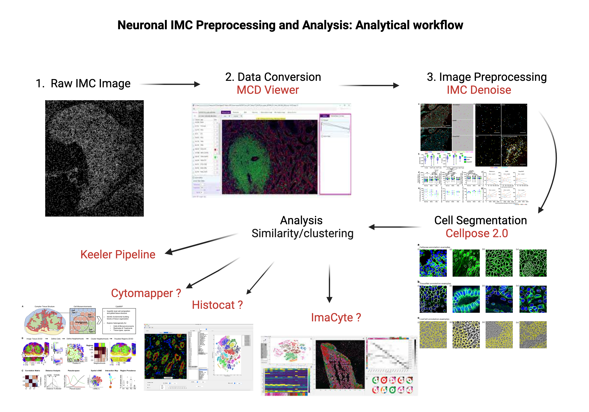

# Neuron-IMC-Processing-and-Analysis

This repository hosts a comprehensive pipeline incorporating adapted code from referenced GitHub repositories  for the processing of Imaging Mass Cytometry (IMC) images specifically tailored for neuronal analysis. Imaging Mass Cytometry is a powerful technique that combines cytometry principles with high-resolution imaging to provide detailed spatial information about molecular expression in tissues. We have done a concise step by step guide on how to set up and run this pipeline. 

### Key Features:

Preprocessing: Streamlined preprocessing steps to enhance image quality, correct artifacts, and optimize data using MCD Viewer and IMC Denoise for subsequent analysis.

Segmentation: Robust algorithms for accurate identification and segmentation of neuronal structures within IMC images using CellPose 2.0.

Feature Extraction: Extract relevant features from neuronal regions, enabling quantitative analysis of molecular expression patterns.

Data Integration: Integration of multi-channel IMC data to provide a holistic view of molecular profiles within neuronal populations.

Visualization: Comprehensive visualization tools for exploring and interpreting processed IMC data, facilitating insightful analysis.

### Contents

Preprocessing:

   [MCD Viewer](https://github.com/KeelerLab/Neuron-IMC-Processing-and-Analysis/blob/288c4f0afa9c82b1a5a9b698432c4678158c595d/Preprocessing/MCDViewer.md)
   
   [IMC Denoise](https://github.com/KeelerLab/Neuron-IMC-Processing-and-Analysis/tree/288c4f0afa9c82b1a5a9b698432c4678158c595d/Preprocessing/IMC_DENOISE)

Analysis:

  [Cellpose2.0](https://github.com/KeelerLab/Neuron-IMC-Processing-and-Analysis/blob/288c4f0afa9c82b1a5a9b698432c4678158c595d/Cell%20segmentation/Cellpose2.0.md)

### Usage:

Follow the step-by-step instructions in the documentation to set up and execute the pipeline.

Customize parameters and configurations to suit your specific IMC dataset and analysis goals.

### Documentation:

Refer to the detailed documentation provided in the 'docs' directory for in-depth explanations, usage guidelines, and examples.

### Contribution:

We welcome contributions from the community. Feel free to open issues, suggest improvements, or submit pull requests.

